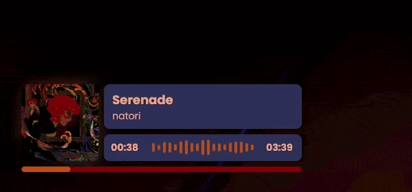

# BeatSaberPlus - Song Overlay for OBS

This overlay can be used in combination with the Song Overlay Plugin as part of BeatSaberPlus by [HardCPP](https://github.com/hardcpp).<br>
It is visually similar to the Amuse widget by [6K Labs](https://6klabs.com/amuse).

**Currently only the 'Compact' player appearance is supported:**



_Note: This version does not show player related data such as score, accuracy and misses. You may use this in combination with a different song overlay that includes this kind of info._

## Installation

1. Add a browser source to your scene in OBS
2. Set the URL to

```
https://bspao.qlulezz.de/

```

3. Match the resolution of the browser source to your scene (for example 1920x1080 or 1280x720)
4. The overlay will now show up whenever you start a map and hide itself when you leave the map.

## Customizations

The overlay can be visually adjusted. Changes are made through URL parameters.

Example: `https://bspao.qlulezz.de/?position=bottom-left&scale=1.2`

The following settings are currently supported:

| Name     | Explanation                                                                                      | Default        | Example                  | Accepted values                                |
| -------- | ------------------------------------------------------------------------------------------------ | -------------- | ------------------------ | ---------------------------------------------- |
| position | The corner the overlay should go in.                                                             | top-left       | ?position=bottom-right   | top-left, top-right, bottom-left, bottom-right |
| scale    | Scaling multiplier with the origin in the specified corner.                                      | 1.0            | ?scale=1.5               | Float between 0.0 and Infinity                 |
| ip       | If you use a second PC to stream, write the IP address and port of the PC running the game here. | 127.0.0.1:2947 | ?ip=192.168.178.112:2947 | IP address + port                              |
| debug    | Will show example data for testing if turned on.                                                 | false          | ?debug=true              | Boolean                                        |

More settings will be added later.

## Help

Want to improve the overlay? [Let me know](https://qlulezz.de/).
